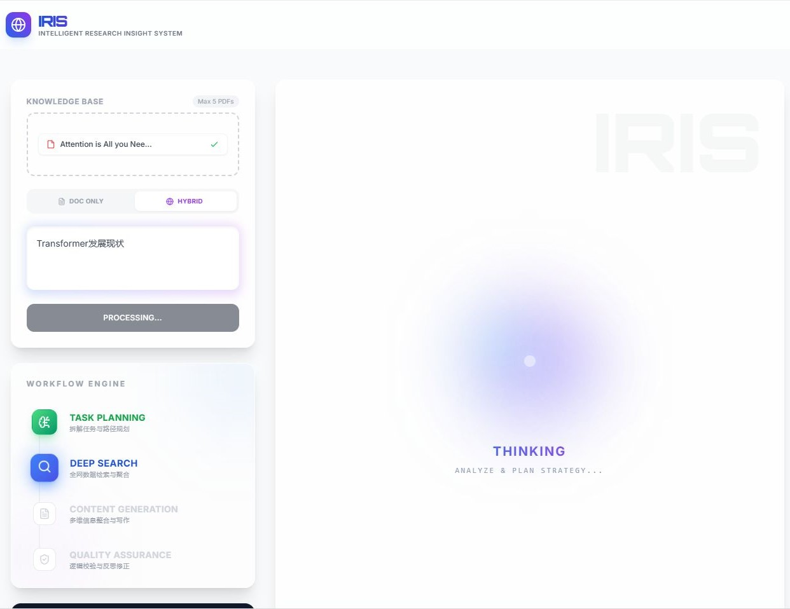
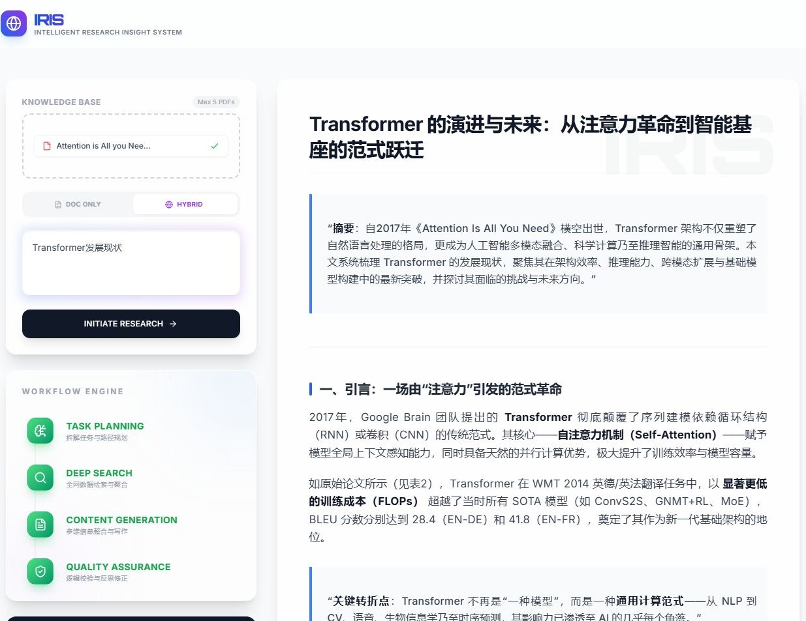

# 🌐 IRIS (Intelligent Research Insight System)

[](https://python.org)
[](https://langchain-ai.github.io/langgraph/)
[](https://fastapi.tiangolo.com/)
[](https://vuejs.org/)

> **IRIS** 是一个基于 **Agentic Workflow（智能体工作流）** 的自动化深度调研与报告生成系统。它摒弃了传统单向 RAG（检索增强生成）的线性问答模式，通过构建多节点状态机（State Machine），实现了从**意图识别、路径规划、动态检索（混合/本地）、深度撰写到自我审查与局部微调**的全自动闭环。
>
> 配套了独立的自动化评测与回测模块——8 条多题型测试用例 + Judge LLM 4 维度自动评分 + 三层 JSON 容错，综合平均分 **94.9/100**，方法论类满分 **100/100**。

### 演示截图

#### 1. 系统主界面

*系统主界面展示，包含对话输入区、文件上传区和响应展示区*

#### 2. 报告生成效果

*系统生成的深度研究报告示例，包含格式化文本、数学公式和图表*

---

## ✨ 核心特性

* 🧠 **Agentic 工作流引擎 (Powered by LangGraph)**
  * 采用图结构（Graph-based）替代传统的链式（LCEL）调用，支持复杂的条件分支与循环流转。
  * 内置 **Router（路由分配）**, **Planner（规划专家）**, **Researcher（检索专家）**, **Writer（主笔）**, **Reviewer（审查员）** 与 **Refiner（修订员）** 等异构节点协同工作。

* 🔍 **两阶段 RAG 检索引擎 (Vector + Cross-Encoder Rerank)**
  * 第一阶段 ChromaDB 向量粗筛 20 个候选文档，第二阶段 Cross-Encoder（ms-marco-MiniLM-L-6-v2）逐对精排取 top-5。
  * 解决传统向量检索"语义相近 ≠ 能回答问题"的缺陷。
  * Embedding 模型支持云端（DashScope text-embedding-v4, 1536 维）→ 本地（moka-ai/m3e-base, 768 维）自动降级。

* 🛡️ **防幻觉与动态路由 (Relevance Grader)**
  * 在本地文档检索后，由轻量级裁判节点（Grader LLM）实时评估文档与问题的相关性。
  * 若文档与问题无关，自动触发**熔断机制**（纯文档模式终止并警告）或**智能降级**（混合模式自动切换全网搜索）。

* 🔄 **会话级记忆与断点续跑 (Session-Level Persistence)**
  * 引入 `AsyncSqliteSaver` (SQLite Checkpoint) 实现会话级持久化。
  * 配合前置 **Intent Router**——LLM 判断 NEW_TOPIC/REFINE + 17 个中文关键词兜底——精准区分"开启新课题"与"修改现有报告"（如"把第一章扩写得更通俗"），实现跨轮次断点续写与局部微调。

* 📊 **自动化评测与回测体系 (Evaluation & Regression)**
  * **独立评测 StateGraph**——复用原有 Planner/Researcher/Writer/Reviewer 节点函数，**零侵入设计**，编译独立的同步评测图。
  * **8 条内置测试用例（6 类题型）**——覆盖技术解释、对比分析、趋势分析、方法论、安全攻防、架构设计，expected_aspects 为 Judge LLM 评分提供锚点。
  * **Judge LLM 4 维度自动评分**——相关性 30% / 完整性 30% / 准确性 25% / 结构 15%，temperature=0 确保评分一致性。
  * **三层 JSON 容错**——正则清洗 → retry prompt → fail-closed 兜底，换模型时稳定不崩溃。
  * **实测数据**：综合平均分 **94.9/100**，相关性 **5.0/5（满分）**，方法论类 **100/100（满分）**，管线零错误。
  * 支持 CLI 一键启动 (`python run_eval.py --debug`) 和 REST API 端点触发。

* ⚡ **全异步架构与流式传输 (Asynchronous & SSE)**
  * 后端基于 **FastAPI + Uvicorn** 全异步 (`async/await`) 架构，无阻塞处理 LLM 节点调度。
  * 采用 **Server-Sent Events (SSE)** 将 Agent 状态流转与打字机效果低延迟推送到前端。

* 🎨 **现代化交互体验 (Modern UI/UX)**
  * 前端采用 **Vue 3 (Composition API) + Vite + Tailwind CSS** 构建，包含仿 iOS Siri"呼吸灯"动效。
  * 深度整合 `markdown-it` 与 KaTeX，通过**正则预处理引擎**攻克跨大模型 LaTeX 定界符不一致问题（`\[...\]` → `$$...$$`），配合 CSS 修复完美渲染数学公式。

---

## 🏗️ 系统架构

### 会话管线 (Session Pipeline)

```text
User Input
    ↓
Intent Router (LLM + 17 关键词兜底)
    ├── NEW_TOPIC → Task Planner
    │                  ↓
    │              Deep Researcher
    │                  ├── ChromaDB 向量粗筛 20 候选
    │                  ├── Cross-Encoder 精排 top-5
    │                  ├── Relevance Grader 审计
    │                  └── Tavily 全网搜索 (hybrid) / 熔断 (document)
    │                  ↓
    │              Content Writer → 基于搜索结果撰写 Markdown
    │                  ↓
    │              Quality Reviewer → PASS → Final Output
    │                               → FAIL → Back to Planner (最多 3 次)
    └── REFINE    → Content Refiner (局部微调，保持结构) → Final Output
```

### 评测管线 (Evaluation Pipeline) — 独立 StateGraph

```text
Test Set (8 cases × 6 categories)
    ↓
For each test_case:
    planner → researcher → writer → reviewer → [FAIL? loop, max 3]
                                                   ↓ PASS
                                              Judge LLM Scoring
                                              (4-dimension × weighted)
                                                    ↓
                                              JSON + Markdown Report
                                                    ↓
                                              evaluation_latest.json/.md
    ↓
Aggregate Metrics (综合平均分 / 题型细分 / 最佳&最差用例)
```

> 会话图走 `astream()` 异步流式 + AsyncSqliteSaver + 6 节点；评测图走 `invoke()` 同步批量 + 无 Checkpointer + 4 节点。共享节点函数但拓扑、执行模式、路由逻辑完全解耦。

---

## 🛠️ 技术栈

### Backend

**Agent 编排层**

| 技术 | 用途 |
|------|------|
| LangGraph 1.x | StateGraph 多节点工作流 + 条件边路由 + Checkpointer 持久化 |
| LangChain Core / OpenAI | BaseMessage / ChatPromptTemplate / ChatOpenAI 统一 API 适配 |

**LLM 层**

| 技术 | 用途 |
|------|------|
| 阿里云 DashScope | API 端点 `dashscope.aliyuncs.com/compatible-mode/v1` |
| qwen3-max (business) | temperature=0.7 — Planner / Writer / Researcher Grader |
| qwen-max (review) | temperature=0 — Reviewer / Judge LLM |

**RAG 检索引擎（两阶段）**

| 技术 | 用途 |
|------|------|
| ChromaDB | 本地持久化向量存储 |
| DashScope text-embedding-v4 | 1536 维云端商用 Embedding（优先） |
| moka-ai/m3e-base | 768 维本地开源 Embedding（自动降级） |
| Cross-Encoder ms-marco-MiniLM-L-6-v2 | 向量粗筛 20 候选 → 精排 top-5 |
| sentence-transformers | CrossEncoder 模型推理框架 |
| PyPDFLoader | PDF 解析（过滤空页/扫描件） |
| RecursiveCharacterTextSplitter | chunk_size=500, chunk_overlap=50 语义分块 |
| Tavily Search API | AI 优化搜索，每个子词 3 条摘要 |

**基础设施层**

| 技术 | 用途 |
|------|------|
| FastAPI + Uvicorn | async/await + SSE 流式 + Swagger 文档 |
| SQLite + aiosqlite | AsyncSqliteSaver 异步 checkpoint |
| Pydantic | 请求体校验 + AgentState TypedDict |
| python-dotenv | .env 多厂商 Key 管理 |

### Frontend

| 技术 | 用途 |
|------|------|
| Vue 3 (Composition API) | `<script setup>` 响应式状态管理 |
| Vite | HMR 热更新 + 生产构建 |
| Tailwind CSS + @tailwindcss/typography | Utility-first 样式 + 长文本优化 |
| markdown-it + markdown-it-katex + KaTeX | Markdown → HTML + 数学公式渲染 |
| lucide-vue-next | SVG 图标组件库 |
| 正则预处理引擎 | 跨 LLM LaTeX 定界符统一（`\[...\]` → `$$...$$`） |

### 评测与回测模块

| 技术 | 用途 |
|------|------|
| LangGraph (独立 StateGraph) | 评测图编译，复用 4 个节点函数，零侵入 |
| Judge LLM (qwen-max, temperature=0) | 4 维度自动评分 |
| 三层 JSON 解析容错 | 正则清洗 → retry → fail-closed 兜底 |
| 8 条用例 / 6 类题型 | 技术解释 / 对比分析 / 趋势分析 / 方法论 / 安全攻防 / 架构设计 |
| 4 个评测 API 端点 | POST 启动 / GET 进度 / GET 报告 / GET 历史 |
| 双格式报告 | JSON (机器) + Markdown (人类)，持久化 + latest 快捷方式 |

---

## 🚀 快速开始

### 1. 后端服务配置

```bash
git clone https://github.com/hhlin-dev/IRIS.git
cd IRIS
```

### 2. 后端服务配置

```bash
cd backend

python -m venv venv
source venv/bin/activate    # Windows: venv\Scripts\activate
pip install -r requirements.txt

# 配置 .env（在 backend 目录下）
# OPENAI_API_KEY=sk-...
# OPENAI_API_BASE=https://dashscope.aliyuncs.com/compatible-mode/v1
# TAVILY_API_KEY=tvly-...
# DASHSCOPE_API_KEY=sk-...  （可选，使用云端 Embedding 时需要）

# 启动
uvicorn main:app --reload --host 0.0.0.0 --port 8000
```
*Swagger 文档：`http://localhost:8000/docs`*

### 3. 前端服务配置

```bash
cd ../frontend
npm install
npm run dev
```
*浏览器访问 `http://localhost:5173`*

### ⚡ 一键启动（推荐）

```bash
python start.py           # 自动装依赖 + 启动前后端 + 打开浏览器
python start.py --stop    # 停止所有服务
python start.py --clean   # 清理环境
```

### 4. 运行自动化评测

```bash
cd backend
python run_eval.py              # 完整 8 条（约 10 分钟）
python run_eval.py --debug      # 单条调试（约 1 分钟）
python run_eval.py --cases 3    # 只跑前 3 条
python run_eval.py --no-save    # 仅终端输出
```

也可通过 API 触发：

```bash
curl -X POST http://localhost:8000/api/evaluate
curl http://localhost:8000/api/evaluate/status
curl http://localhost:8000/api/evaluate/report/latest?format=md
```

---

## 📡 API 端点

| 方法 | 路径 | 说明 |
|------|------|------|
| POST | `/api/chat` | 会话交互（SSE 流式） |
| POST | `/api/upload` | PDF 上传 → ChromaDB 向量化 |
| POST | `/api/clear` | 清空知识库 |
| **POST** | **`/api/evaluate`** | **启动评测** |
| **GET** | **`/api/evaluate/status`** | **评测进度 + 最近摘要** |
| **GET** | **`/api/evaluate/report/latest?format=json\|md`** | **下载最新报告** |
| **GET** | **`/api/evaluate/report/history`** | **历史报告列表** |

---

## 📂 项目结构

```
IRIS/
├── backend/
│   ├── app/
│   │   ├── api/routes.py            # FastAPI 路由（SSE 流式 + 7 个端点）
│   │   ├── graph/                   # LangGraph 智能体管线
│   │   │   ├── nodes/               #   6 个节点 (planner/researcher/writer/reviewer/router/refiner)
│   │   │   ├── state.py             #   AgentState TypedDict
│   │   │   └── graph.py             #   StateGraph 编译 + 条件边连线
│   │   ├── rag/engine.py            # RAG 引擎 (ChromaDB + Cross-Encoder + Embedding 降级)
│   │   ├── tools/search.py          # Tavily Search API 封装
│   │   ├── utils/llm.py             # LLM 工厂函数 (get_llm)
│   │   └── evaluation/              # 自动化评测模块
│   │       ├── evaluator.py         #   评测编排器 + 独立 StateGraph
│   │       ├── metrics.py           #   Judge LLM + 4 维度评分 + 三层容错
│   │       └── test_set.py          #   8 条内置用例
│   ├── evaluation_reports/          # 评测报告输出
│   │   ├── evaluation_latest.json
│   │   └── evaluation_latest.md
│   ├── run_eval.py                  # 一键评测启动脚本
│   ├── main.py                      # FastAPI 入口 + CORS + Uvicorn
│   └── requirements.txt
├── frontend/
│   ├── src/
│   │   ├── components/              # Vue 组件 (StatusFlow 等)
│   │   ├── services/api.js          # SSE 流式 + REST API 封装
│   │   └── App.vue                  # 主页面 + LaTeX 预处理 + 打字机
│   └── package.json
├── docs/
│   ├── EVALUATION_MODULE.md         # 评测模块详细文档
│   ├── demo1.jpeg
│   └── demo2.jpeg
├── start.py
│
└── README.md
```

---

## 💡 研发心得

### 1. "零侵入"评测管线设计

核心挑战：如何在不修改原项目任何节点的前提下，构建独立评测体系？

解决方案：复用 `planner.py / researcher.py / writer.py / reviewer.py` 的节点函数但一行不改。编译独立的 `StateGraph`——评测图 `invoke()` 同步批量，会话图 `astream()` 异步流式。共享节点函数，拓扑/路由/执行模式完全解耦。总增量 ~900 行，仅修改 `routes.py` 增加 4 个端点。

### 2. Judge LLM 评分可靠性

LLM 输出格式不稳定（JSON 解析失败率 5-10%）。

解决方案：三层容错——正则清洗 + json.loads → 更严格 retry prompt → fail-closed 兜底（全维度归零 + 标记）。实测 8 条评测第一层全部通过，但二三层保证换模型时的鲁棒性。

### 3. 跨模型 LaTeX 定界符适配

GPT 输出 `\[...\]`，KaTeX 只认 `$$...$$`，部分模型甚至不带反斜杠。

解决方案：前端正则预处理引擎统一定界符 + CSS 修复（Tailwind `box-sizing: border-box` 破坏 KaTeX 布局）。

### 4. 两阶段 RAG 检索

向量相似度缺陷：语义相近 ≠ 能回答问题。

解决方案：ChromaDB 粗筛 20 候选 → Cross-Encoder (ms-marco-MiniLM-L-6-v2) 精排 top-5。Embedding 支持 DashScope 云端 → m3e-base 本地自动降级。评测数据验证：相关性维度满分 5.0/5。
